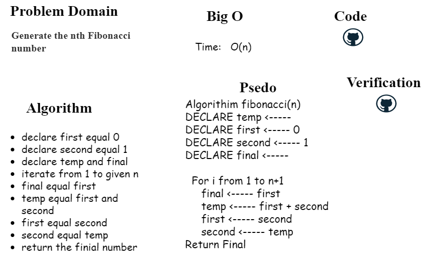

# Q2 Generate the nth Fibonacci number.

<!-- Description of the challenge -->
function to accepts an integer, and returns the nth number in the Fibonacci sequence.

## Whiteboard Process
<!-- Embedded whiteboard image -->

## Approach & Efficiency
<!-- What approach did you take? Discuss Why. What is the Big O space/time for this approach? -->
iterating n times. Big O (n)
