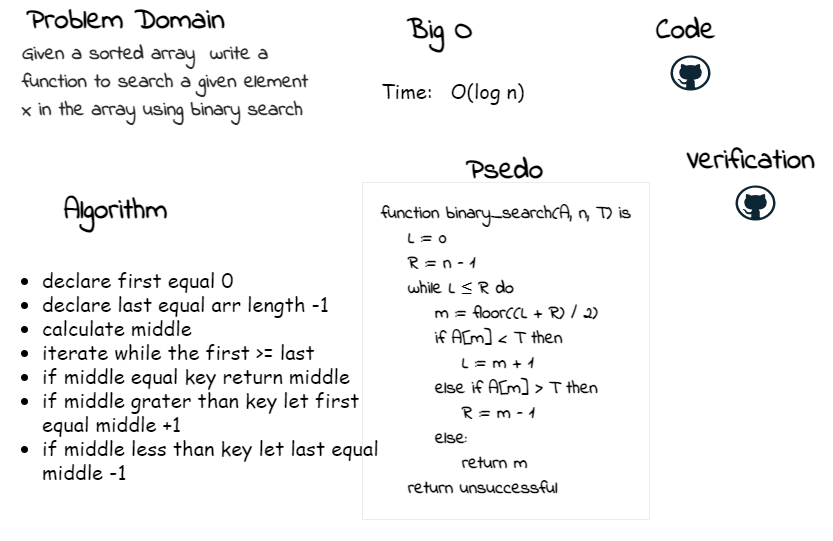

# Binary Search of Sorted Array
<!-- Description of the challenge -->
Write a function called BinarySearch which takes in 2 parameters: a sorted array and the search key and return the index of key
## Whiteboard Process
<!-- Embedded whiteboard image -->

## Approach & Efficiency
<!-- What approach did you take? Discuss Why. What is the Big O space/time for this approach? -->
Big O(log n) becuse it use the information that the array is sorted and reduce the time complexity to O(Log n) basically it ignore half of the elements just after one comparison.

 
