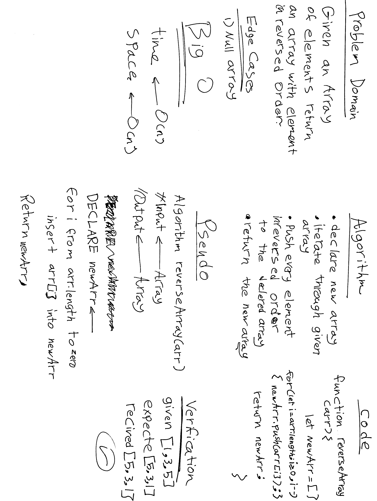

# Reverse an Array
<!-- Description of the challenge -->
given an array of elements return an array with elements in reversed oreder 
## Whiteboard Process
<!-- Embedded whiteboard image -->

## Approach & Efficiency
<!-- What approach did you take? Discuss Why. What is the Big O space/time for this approach? -->
iterating through all array elements from last element to the first.
Big O notation is used in computer science to describe the performance or complexity of an algorithm. Big O specifically describes the worst-case scenario, and can be used to describe the execution time required or the space used by an algorithm.