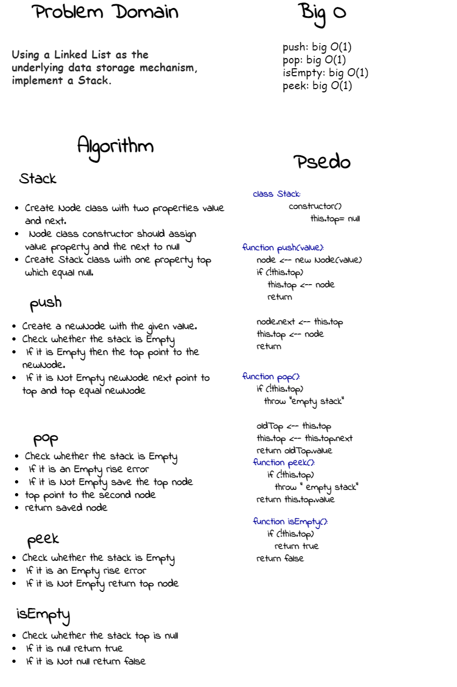
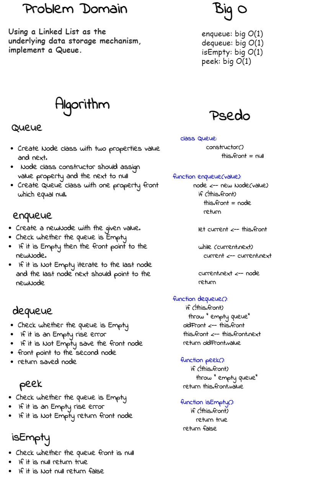

# Stacks and Queues
<!-- Short summary or background information -->
Using a Linked List as the underlying data storage mechanism, implement both a Stack and a Queue.

## Challenge
<!-- Description of the challenge -->
- Create a Stack class that has a top property. It creates an empty Stack when instantiated.
- Create a Queue class that has a front property. It creates an empty Queue when instantiated.

## Whiteboard Process
<!-- Embedded whiteboard image -->
### Stack

### Queue

## Approach & Efficiency
<!-- What approach did you take? Why? What is the Big O space/time for this approach? -->
In short, O(1) means that it takes a constant time, like 14 nanoseconds, or three minutes no matter the amount of data in the set.
- enqueue: big O(1)
- dequeue: big O(1)
- isEmpty: big O(1)
- peek: big O(1)
- pop: big O(1)
- push : big O(1)

## API
<!-- Description of each method publicly available to your Linked List -->
- enqueue
`adds a new node with that value to the back of the queue with an O(1)`
- dequeue
`returns the value from node from the front of the queue and removes the node from the front of the queue`
- pop
`returns the value from node from the top of the stack and removes the node from the top of the stack`
- push
`adds a new node with that value to the top of the stack with an O(1) Time performance`
- isEmpty
`Returns: Boolean indicating whether or not the queue or stack is empty`
- peek
`returns Value of the node located at the front of the queue and the top of the stack`

