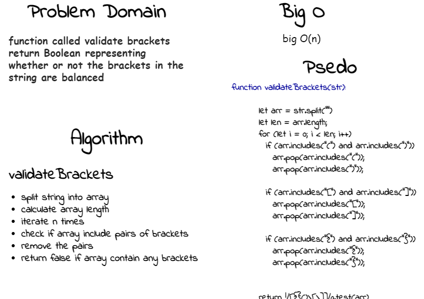

# Multi-bracket Validation.

<!-- Short summary or background information -->

validate whether or not the brackets in a string are balanced

## Challenge

<!-- Description of the challenge -->

Create a function called validate brackets return Boolean representing whether or not the brackets in the string are balanced

## Whiteboard Process

<!-- Embedded whiteboard image -->

## Approach & Efficiency

<!-- What approach did you take? Why? What is the Big O space/time for this approach? -->

the function time complexity O(n) increase linearly and in direct proportion to the number of inputs.

we check for brackets in pairs and remove them in pairs, finally return false if there is any bracket left
