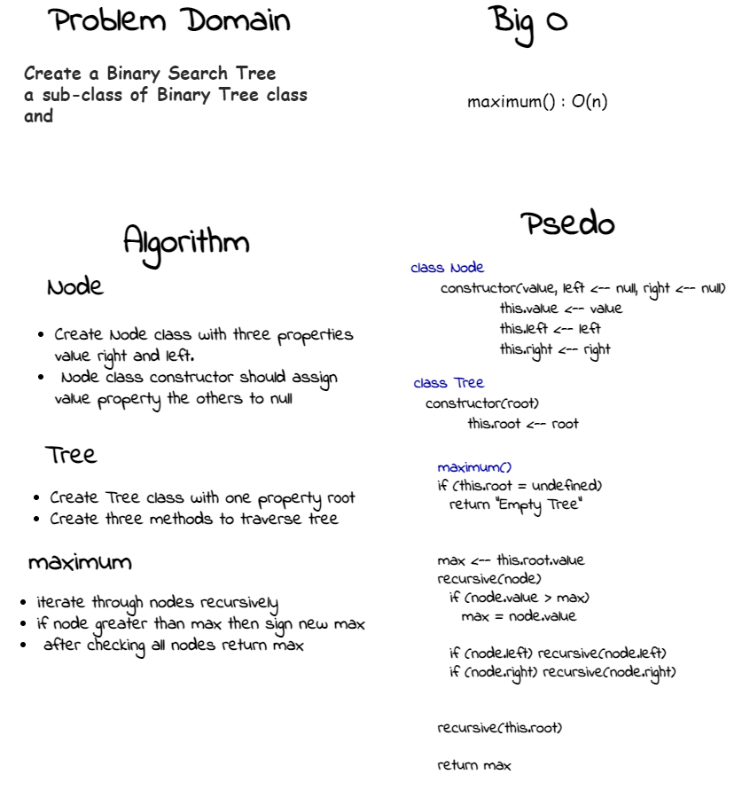

# Tree Maximum 
<!-- Short summary or background information -->
a hierarchical structure as elements in a Tree are arranged in multiple levels.
## Challenge
<!-- Description of the challenge -->
Find the maximum value stored in the tree. You can assume that the values stored in the Binary Tree will be numeric.
## Whiteboard Process
<!-- Embedded whiteboard image -->

## Approach & Efficiency
<!-- What approach did you take? Why? What is the Big O space/time for this approach? -->
maximum() : iterate throgth all nodes and check if the node value is greater than the max or not to sign the new max
Big O(n)

## API
<!-- Description of each method publicly available to your Linked List -->

- maximum ` Find the maximum value stored in the tree.  `
